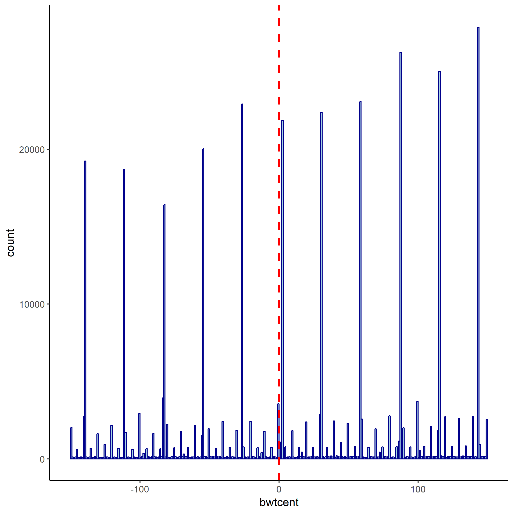
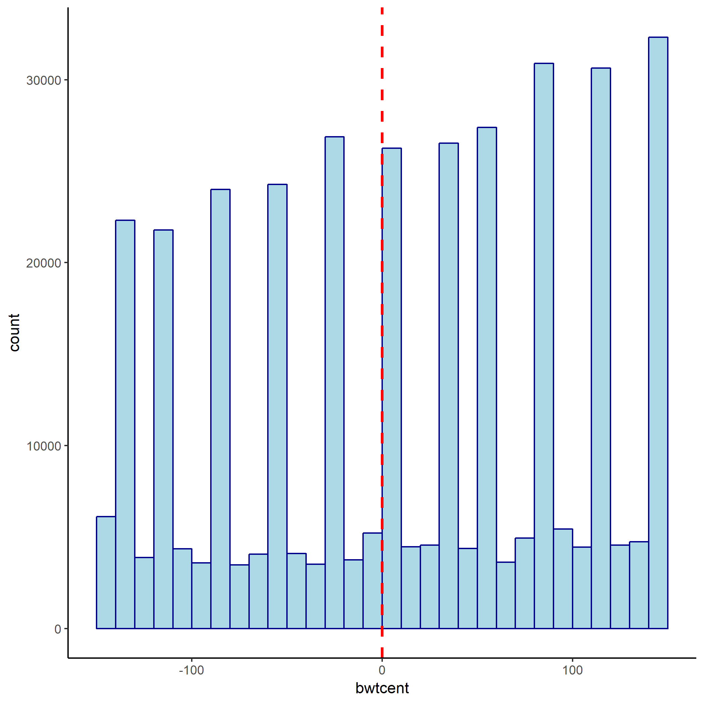
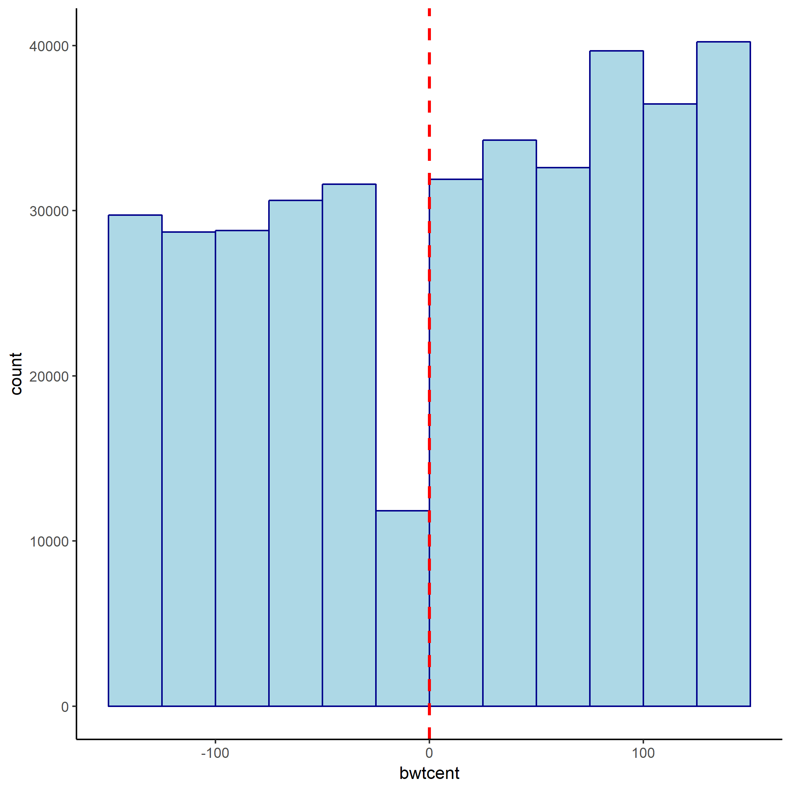

```{r setup, include=FALSE}
knitr::opts_chunk$set(echo = TRUE, warning = FALSE, message = FALSE, include = TRUE, eval = TRUE)
```

# Problem 1: Application: Low Birth Weight and Infant Health
This application is predominatly a replication of @almond10 and @barreca11.

```{r, echo = FALSE, out.width = "50%"}
library(knitr)



```

## a. To ease interpretation of the results, create a birth variable for which 1500g corresponds to zero.
See code.


## b. Show the distribution of birth weights around the 1500-gram cutoff. Is the distribution of weight smooth?

The distribution of weight is not smooth, with peaks observed at regular intervals. There are also fewer observations right below the cutoff.

## c. Explain why non-random sorting across the treatment threshold is a concern in RD designs. Make your argument explicit and apply them to this particular example.
Non-random sorting is an issue because it might lead to a violation of the assumption of continous potential outcomes at the cutoff. 
If physicians in hospitals with fewer resources, which tend to serve low-income families, are more likely to report a birth weight right above the cutoff than physicians in hospitals attended by wealthy patients to avoid using the resources needed in handling low-weight newborns,
then their will be a jump in the potential outcomes at the cutoff. For a given treatment status (being handled as a low-weight newborn or not), babies on the left of the cutoff will tend to come from richer families which is likely to be associated with better health and future education and income levels.

# Problem 2: Application: Cultural Background and Fertility
Consider the working paper by @pettersson17.

##a. What is the treatment analyzed by the authors? What else can be considered as the treatment in this framework? What are the outcomes considered by the authors?

I am not sure that the authors have a clear causal model in mind.
They define the treatment as a nationwide fertility policy that incentivized working women to have an additional child within 24 months of the birth of the previous child.
Given that the authors want to study the cultural assimilation of immigrants, an alternative definition of treatment would be the age at which a woman arrived in Sweden or whether a native woman's mother is an immigrant. (The authors use similar demographics to define their treatment groups.)

The authors consider cultural assimilation as the outcome, proxied by the deviation from the mean among local (native) women of an indicator variable for having an additional child within 24 months of the previous birth.


##b. The authors say that "Although previous research - the epidemiological approach to culture - has found strong correlations between cultural traits and fertility choices, there is still an issue with unmeasured immigrant characteristics". What could be these unmeasured immigrant characteristics? Why is it an issue for identification?
We might argue that immigrants are individuals who care a lot about their offsprings. They might have decided to immigrate to another country to offer them a brighter future. Hence, they might prefer to have more children than the natives. Another confounder is the potential wage. Immigrant women might have a lower potential wage than natives and, as such, decide to have more children.

Because of these potential confounders, we cannot intepret the difference in fertility rate between immigrant and native women as being caused by a difference in cultural traits.

##c. Their approach (which they call difference-in-difference) consists in comparing the fertility pattern of immigrants and Swedish natives before and after the introduction of the nation-wide reform. How does this approach deal with the issue of unmeasured immigrant characteristics? What is the underlying assumption?

Because the authors observe the fertility pattern of immigrants and Swedish natives before the reform, they can control for the pre-existing difference in fertility. 
Hence assuming that these unobservable characteristics remain constant over time, controlling for the initial difference in fertility effectively deals with the impact of these unobservables on the percentage of women who were having an additional child within 24 months under the pre-reform policy.
The underlying assumption is that the unmeasured immigrant characteristics affect the level of the fertility rate within 24 months and not the slope with respect to financial incentives to have more children within 24 months. This does not seem likely to hold though, especially since the authors do not control for any immigrant characteristics. First-generation immigrants from traditional countries are likely to have a lower baseline labor force participation rate than natives, and therefore to be less sensitive to a change in financial incentives for women in the labor force regarding fertility decisions.

##d. The authors show that the pre-policy fertility choices for natives and immigrants are both flat and parallel although at different levels. What conclusion can you draw about the internal and external validity of this study?
I conclude from the plots that the whole group of native Swedish mothers is a poor control group for immigrant mothers in order to study fertility decisions.
Indeed, we would like the control group to be as similar as possible to the treatment group. 
I am not enclined to believe that the policy would have had the same impact on immigrant mothers' fertility decisions as it did for native Swedish mothers if the immigrant mothers had the same cultural background as the Swedish mothers.
Hence, since the critical identification assumption is likely to be violated, the internal validity of this study is low.
Given that the study abstract from controlling for any immigrant characteristics and does not identify any mechanism, even if we were to consider the results reliable we would not be able to use them to extrapolate to another setting.

##e. What could be one concern with this identification strategy, if any? Could you test for it?
As a first robustness check, we could study whether the results hold when we restrict the sample to immigrant and Swedish mothers with similar characteristics (labor force participation, household income, education,...). Nevertheless, since the design is not really a DiD (as everyone in the sample is treated at the same time), identification relies on the CIA assumption which we cannot test.

# References
